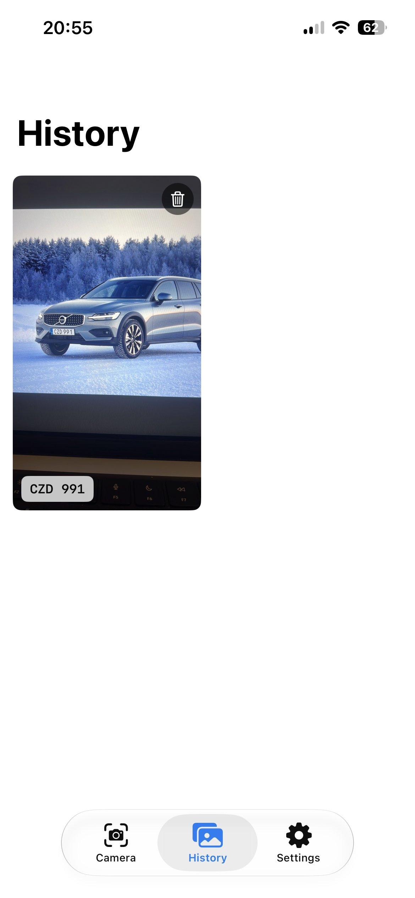
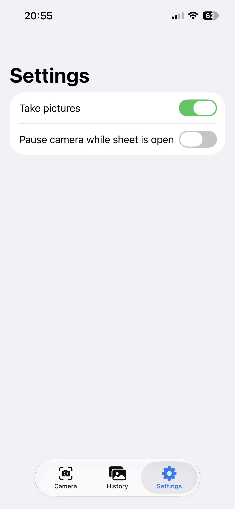

# Dinnerplate

Point camera at a Swedish license **(dinner)plate** to instantly retrieve information about the vehicle and its owner

## App preview

  
  
  

## Features

Point the camera at any Swedish vehicle registration plate. The app automatically detects the plate, captures a photo, and displays a details sheet with relevant vehicle information. Each scan is saved to the History tab for easy access later.

The Settings tab includes several options that let you tailor the scanning experience to your preferences, making the app faster and more convenient to use.
